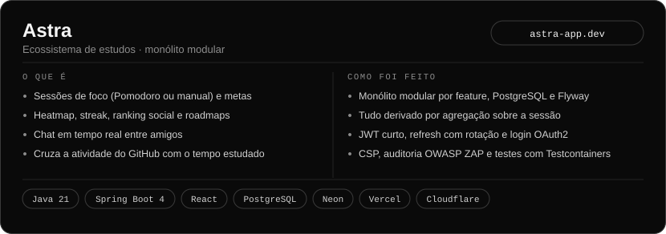

<h1>Kauan Di Nubila </h1>

<strong>Desenvolvedor Back-End · Java &amp; Spring Boot</strong>

  
  
  

## Sobre

Desenvolvedor back-end com foco em Java e Spring Boot, cursando Análise e Desenvolvimento de Sistemas. Tenho construído aplicações completas, desde a modelagem e desenvolvimento das APIs até testes, segurança, infraestrutura e deploy em produção.

Meu foco está no desenvolvimento de sistemas bem estruturados, com atenção a arquitetura, segurança, integração entre serviços e qualidade de código. Nos meus projetos, tenho explorado tanto arquiteturas modulares quanto microserviços, além de tecnologias como mensageria, comunicação em tempo real e cloud.

- **Dois produtos full-stack próprios em produção**: um em monólito modular e outro em microsserviços, com mensageria, circuit breaker, rate limiting e observabilidade.
- Experiência prática com desenvolvimento e operação de aplicações, incluindo Docker, CI/CD, testes automatizados, TLS e implementação de camadas de segurança com JWT, rotação de refresh tokens, RBAC e CSP.
- Português nativo, inglês avançado.

## Tecnologias

## Estatísticas

  
  

## Projetos em produção

[Demo ao vivo](https://astra-app.dev) · [Código](https://github.com/KauanDiNubila/astra)

[Demo ao vivo](https://lexo-kauan1.duckdns.org) · [Código](https://github.com/KauanDiNubila/lexo-backend)

## Mais projetos

| Projeto | O que resolve | Stack |
|---|---|---|
| **[Ledger](https://github.com/KauanDiNubila/ledger)** | Importação em lote de transações financeiras: linha inválida é isolada com o motivo, o mesmo arquivo não entra duas vezes (hash SHA-256) e o volume é lido em *chunks* | Spring Batch, PostgreSQL |
| **[Codechella](https://github.com/KauanDiNubila/Codechella)** | API reativa de eventos e ingressos, usada para comparar desempenho reativo e bloqueante sob carga | WebFlux, R2DBC, Flyway |
| **[Gestão Financeira API](https://github.com/KauanDiNubila/gestao-financeira-api)** | Receitas e despesas com JWT, relatório mensal e gastos por categoria. [Demo](https://gestao-financeira-api-ss04.onrender.com) | Spring Boot, JPA, Docker |
| **[Nexus Roadmap](https://github.com/KauanDiNubila/nexusRoadmap)** | Trilha de estudos gamificada com árvore de tecnologias, XP e Pomodoro | Spring Boot, React Flow |

## Contato

Aberto a oportunidades como desenvolvedor. [LinkedIn](https://www.linkedin.com/in/kauan-di-nubila-933562263/) · [kauandinubila@gmail.com](mailto:kauandinubila@gmail.com)
