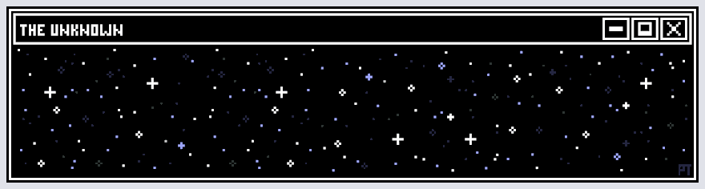
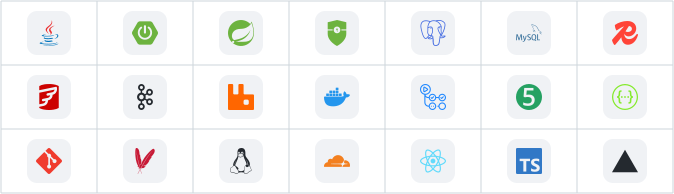
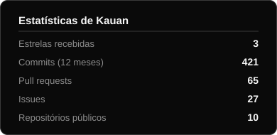
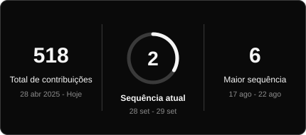
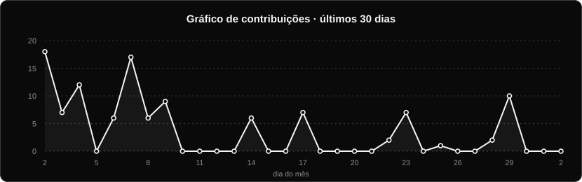

<h1>Kauan Di Nubila </h1>

<strong>Desenvolvedor Back-End · Java &amp; Spring Boot</strong>

  
  
  

## Sobre

Desenvolvedor back-end com foco em Java e Spring Boot, cursando Análise e Desenvolvimento de Sistemas. Tenho construído aplicações completas, desde a modelagem e desenvolvimento das APIs até testes, segurança, infraestrutura e deploy em produção.

Meu foco está no desenvolvimento de sistemas bem estruturados, com atenção a arquitetura, segurança, integração entre serviços e qualidade de código. Nos meus projetos, tenho explorado tanto arquiteturas modulares quanto microserviços, além de tecnologias como mensageria, comunicação em tempo real e cloud.

- **Dois produtos full-stack próprios em produção**, um em microsserviços e outro em monólito modular, com mensageria, *circuit breaker*, *rate limiting* e observabilidade.
- **Infraestrutura real:** containers, TLS, CI/CD, testes automatizados e segurança em camadas (JWT com rotação de refresh token, RBAC, CSP).
- Português nativo, inglês avançado.

## Tecnologias

## Estatísticas

  
  

## Projetos em produção

| | |
|---|---|
| **[Astra](https://github.com/KauanDiNubila/astra)** Ecossistema de estudos | Sessões de foco (Pomodoro ou manual), dashboard, metas, roadmaps, ranking social e chat em tempo real, tudo agregado sobre um único núcleo: a sessão. Monólito modular por feature; JWT curto com refresh em cookie `httpOnly`, rotação e detecção de reuso; senha recusada se vazada; CSP restritiva; auditoria com OWASP ZAP.  `Java 21` `Spring Boot 4` `React` `PostgreSQL` `Neon` `Vercel` `Cloudflare` **[astra-app.dev](https://astra-app.dev)** |
| **[Lexo](https://github.com/KauanDiNubila/lexo-backend)** SaaS jurídico em microsserviços | 9 serviços com API Gateway e Eureka, banco isolado por serviço, **Kafka** para eventos de domínio e **RabbitMQ** com *dead-letter queue*. *Circuit breaker* (Resilience4j), *rate limiting* no gateway, *tracing* distribuído (Zipkin) e identidade assinada entre serviços. IA com Google Gemini (resumo de processos, assistente, petições) e portal público do cliente por *magic link*. Deploy na Oracle Cloud com HTTPS automático.  `Java 21` `Spring Cloud` `Kafka` `RabbitMQ` `Redis` `PostgreSQL` `Gemini` `Docker` **[lexo-kauan1.duckdns.org](https://lexo-kauan1.duckdns.org)** |

## Mais projetos

| Projeto | O que resolve | Stack |
|---|---|---|
| **[Ledger](https://github.com/KauanDiNubila/ledger)** | Importação em lote de transações financeiras: linha inválida é isolada com o motivo, o mesmo arquivo não entra duas vezes (hash SHA-256) e o volume é lido em *chunks* | Spring Batch, PostgreSQL |
| **[Codechella](https://github.com/KauanDiNubila/Codechella)** | API reativa de eventos e ingressos, usada para comparar desempenho reativo e bloqueante sob carga | WebFlux, R2DBC, Flyway |
| **[Gestão Financeira API](https://github.com/KauanDiNubila/gestao-financeira-api)** | Receitas e despesas com JWT, relatório mensal e gastos por categoria. [Demo](https://gestao-financeira-api-ss04.onrender.com) | Spring Boot, JPA, Docker |
| **[Nexus Roadmap](https://github.com/KauanDiNubila/nexusRoadmap)** | Trilha de estudos gamificada com árvore de tecnologias, XP e Pomodoro | Spring Boot, React Flow |

## Contato

Aberto a oportunidades como desenvolvedor back-end Java. [LinkedIn](https://www.linkedin.com/in/kauan-di-nubila-933562263/) · [kauandinubila@gmail.com](mailto:kauandinubila@gmail.com)
